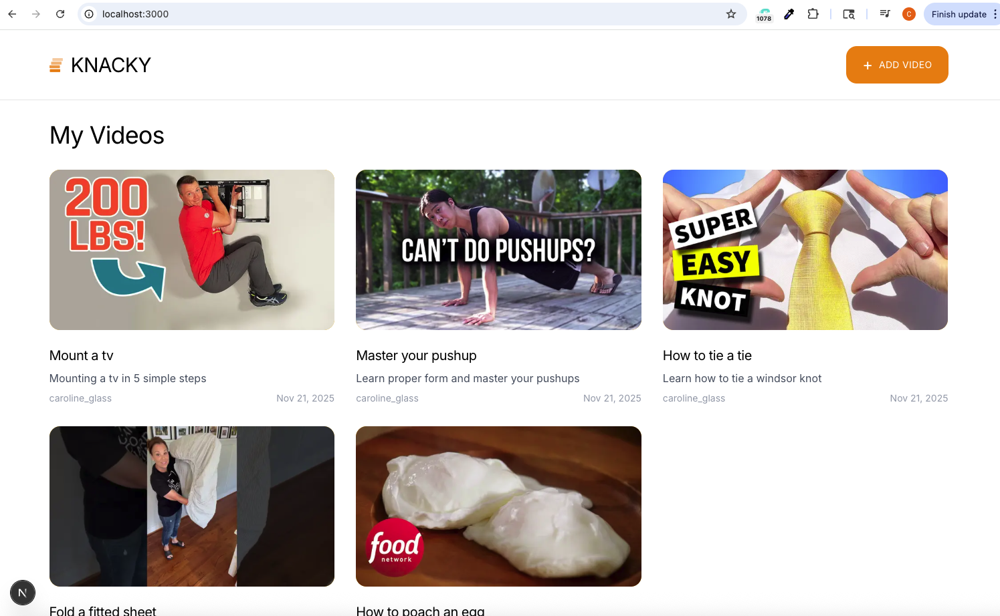
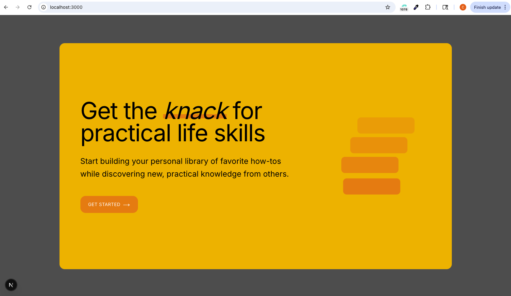
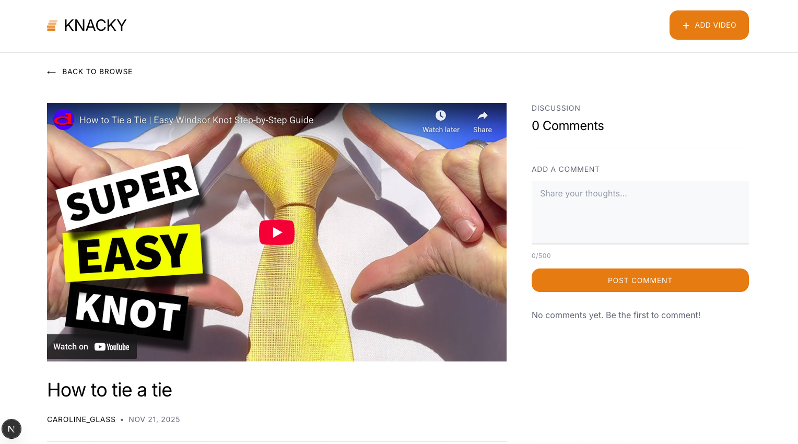
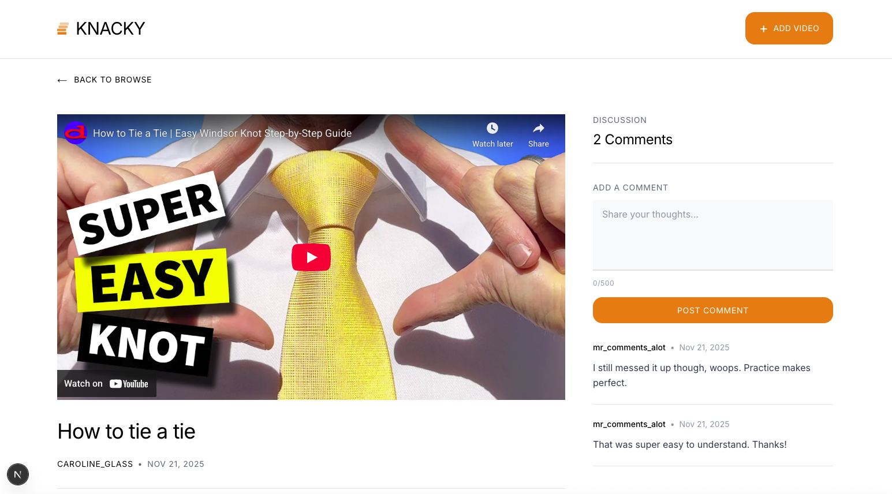
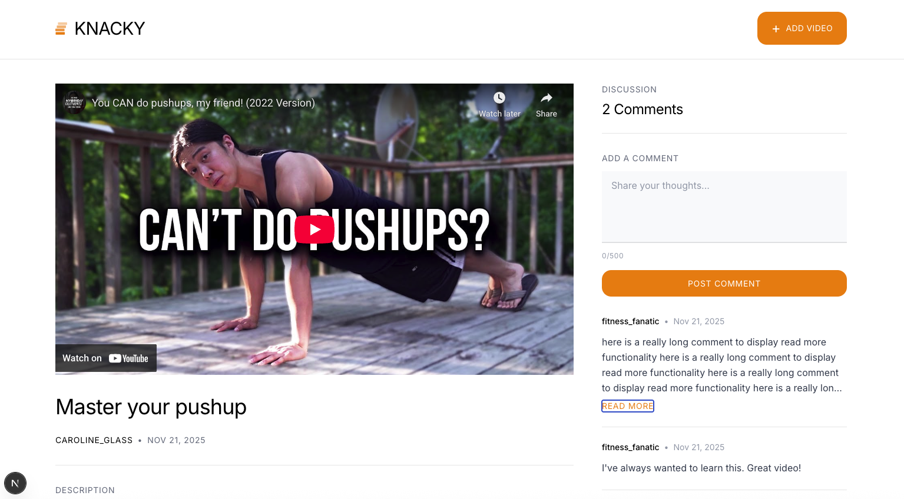
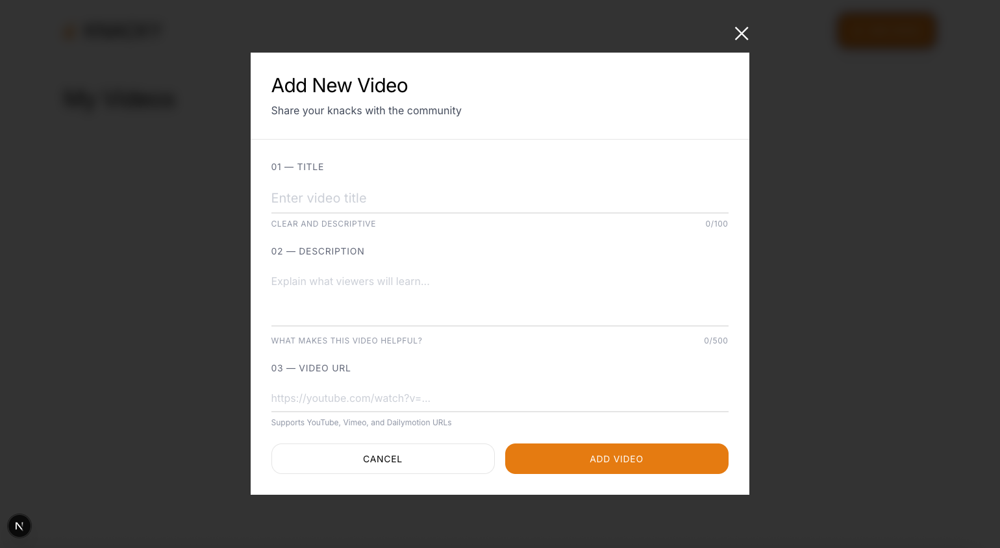
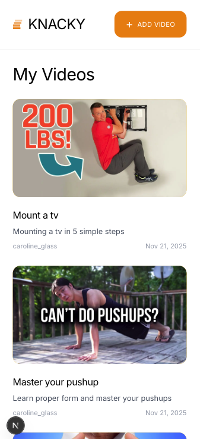
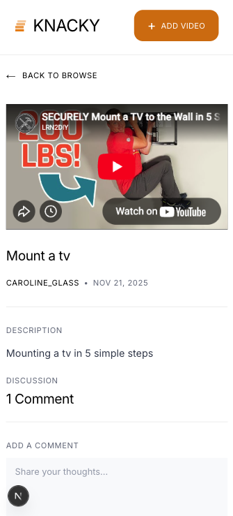
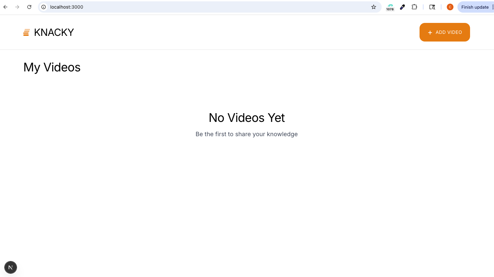

# Knacky - Educational Video Platform

Thanks for taking the time to check out my project! I had a lot of fun building this and hope you enjoy exploring it.

A modern, full-stack educational video platform built with Next.js 16 that enables users to upload, browse, and discuss video tutorials. Share practical life skills and learn from community-contributed content.

## Table of Contents

- [Overview](#overview)
- [Features](#features)
- [Tech Stack](#tech-stack)
- [Getting Started](#getting-started)
- [Project Structure](#project-structure)
- [Architecture Decisions](#architecture-decisions)
- [Screenshots](#screenshots)
- [API Integration](#api-integration)
- [Testing the Application](#testing-the-application)

## Overview

Knacky is a community-driven video platform designed for sharing practical knowledge and tutorials. Users can:

- Browse a curated collection of educational videos
- Upload videos from YouTube, Vimeo, or Dailymotion
- Engage with content through comments and discussions
- Enjoy a responsive, accessible experience across all devices

The application follows modern React patterns with Next.js App Router, featuring server-side rendering for optimal performance and SEO, client-side interactivity where needed, and a clean, minimalist design system.

## Features

- **Video Browsing** - Responsive grid with auto-generated thumbnails
- **Video Playback** - Embedded player for YouTube, Vimeo, and Dailymotion
- **Video Upload** - Add videos via URL with validation
- **Comments** - Post and view comments with character limits
- **Welcome Splash** - First-visit onboarding (localStorage persisted)
- **Responsive Design** - Mobile-first with tablet and desktop breakpoints

## Tech Stack

| Category       | Technology              |
| -------------- | ----------------------- |
| **Framework**  | Next.js 16 (App Router) |
| **Language**   | TypeScript 5            |
| **UI Library** | React 19                |
| **Styling**    | Tailwind CSS 4          |
| **Fonts**      | Inter & Geist Mono      |
| **Linting**    | ESLint 9                |
| **Formatting** | Prettier                |

## Getting Started

### Prerequisites

- Node.js 18.x or higher
- npm, yarn, or pnpm

### Installation

1. **Clone the repository**

   ```bash
   git clone https://github.com/yourusername/knacky-video-platform.git
   cd knacky-video-platform
   ```

2. **Install dependencies**

   ```bash
   npm install
   # or
   yarn install
   # or
   pnpm install
   ```

3. **Run the development server**

   ```bash
   npm run dev
   # or
   yarn dev
   # or
   pnpm dev
   ```

4. **Open the application**

   Navigate to [http://localhost:3000](http://localhost:3000) in your browser.

### Build for Production

```bash
npm run build
npm run start
```

## Project Structure

```
├── app/                          # Next.js App Router
│   ├── page.tsx                  # Home page (video grid)
│   ├── layout.tsx                # Root layout with Header
│   ├── loading.tsx               # Global loading state
│   ├── error.tsx                 # Global error boundary
│   ├── globals.css               # Global styles, button classes & animations
│   └── video/[id]/               # Dynamic video detail route
│       ├── page.tsx              # Video player + comments
│       ├── loading.tsx           # Video page loading state
│       └── error.tsx             # Video page error boundary
│
├── components/                   # React components
│   ├── SplashWrapper.tsx         # App-level splash screen manager
│   ├── SplashScreen.tsx          # Welcome modal for first-time visitors
│   ├── Header.tsx                # Navigation with Add Video button
│   ├── HomePage.tsx              # Home page container
│   ├── VideoGrid.tsx             # Responsive video card grid
│   ├── VideoPlayer.tsx           # Embedded player with metadata
│   ├── AddVideoModal.tsx         # Video upload form modal
│   ├── CommentsList.tsx          # Comments container
│   ├── CommentForm.tsx           # Comment submission form
│   ├── CommentItem.tsx           # Individual comment display
│   └── LoadingSpinner.tsx        # Reusable loading indicator
│
├── lib/                          # Utilities and API
│   ├── api/
│   │   ├── videos.ts             # Video API functions
│   │   └── comments.ts           # Comments API functions
│   ├── types.ts                  # TypeScript interfaces
│   ├── constants.ts              # App constants
│   └── utils.ts                  # Helper functions
│
└── public/                       # Static assets
```

## Architecture Decisions

- **Server Components** - Data fetching and SEO-optimized rendering
- **Client Components** - Interactive elements (modals, forms, localStorage)
- **Parallel Data Fetching** - `Promise.all()` for concurrent requests
- **Global CSS Classes** - Reusable button styles (`.btn`, `.btn-primary`, `.btn-secondary`)
- **12-Column Grid** - Consistent responsive layouts
- **TypeScript Strict Mode** - Full type safety throughout

## Screenshots

> Add screenshots of your application here

### Home Page (Video Grid)



### Welcome Splash Screen



### Video Detail Page





### Add Video Modal



### Mobile Responsive View




### No Video Yet View



## API Integration

The application integrates with a REST API backend:

### Endpoints

| Method | Endpoint                                  | Description                 |
| ------ | ----------------------------------------- | --------------------------- |
| GET    | `/api/videos?user_id={userId}`            | Fetch all videos for a user |
| GET    | `/api/videos/single?video_id={videoId}`   | Fetch single video by ID    |
| POST   | `/api/videos`                             | Create new video            |
| GET    | `/api/videos/comments?video_id={videoId}` | Fetch comments for a video  |
| POST   | `/api/videos/comments`                    | Post a new comment          |

### Data Types

```typescript
interface Video {
  id: string;
  title: string;
  description: string;
  video_url: string;
  user_id: string;
  created_at: string;
  num_comments: number;
}

interface Comment {
  id: string;
  video_id: string;
  content: string;
  user_id: string;
  created_at: string;
}
```

## Testing the Application

### Manual Testing Checklist

#### Home Page

- [ ] Splash screen appears on first visit
- [ ] Splash screen dismisses and doesn't reappear
- [ ] Videos load and display in a grid
- [ ] Thumbnails render correctly for YouTube/Vimeo/Dailymotion videos
- [ ] Video count displays correctly
- [ ] Clicking a video navigates to detail page

#### Video Detail Page

- [ ] Video player loads and plays embedded video
- [ ] Video title, description, and metadata display correctly
- [ ] Back button navigates to home page
- [ ] Comments load and display

#### Add Video

- [ ] Modal opens when clicking "Add Video"
- [ ] Form validates required fields
- [ ] Invalid URLs show error message
- [ ] Successful submission creates video and navigates home
- [ ] Character counters work correctly

#### Comments

- [ ] Comment form submits successfully
- [ ] New comments appear after submission
- [ ] Character limit enforced (500 characters)
- [ ] Long comments show "Read more" button

#### Responsive Design

- [ ] Layout adapts on mobile (single column)
- [ ] Layout adapts on tablet (two columns)
- [ ] Layout adapts on desktop (three columns)
- [ ] Modal and forms are usable on all screen sizes

### Test Video URLs

Use these URLs to test video upload functionality:

```
YouTube:     https://www.youtube.com/watch?v=dQw4w9WgXcQ
YouTube:     https://youtu.be/dQw4w9WgXcQ
Vimeo:       https://vimeo.com/148751763
Dailymotion: https://www.dailymotion.com/video/x8m7nv3
```

---

Built with Next.js, React, and Tailwind CSS
